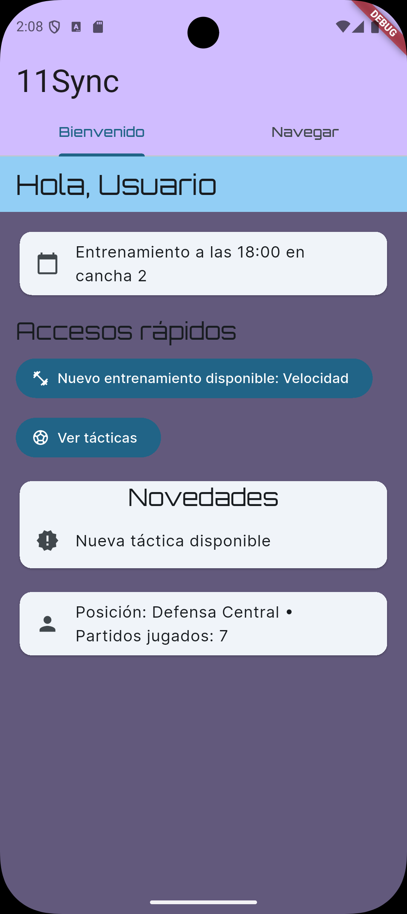
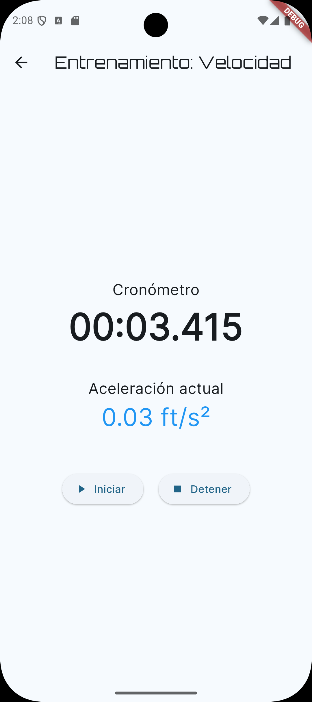
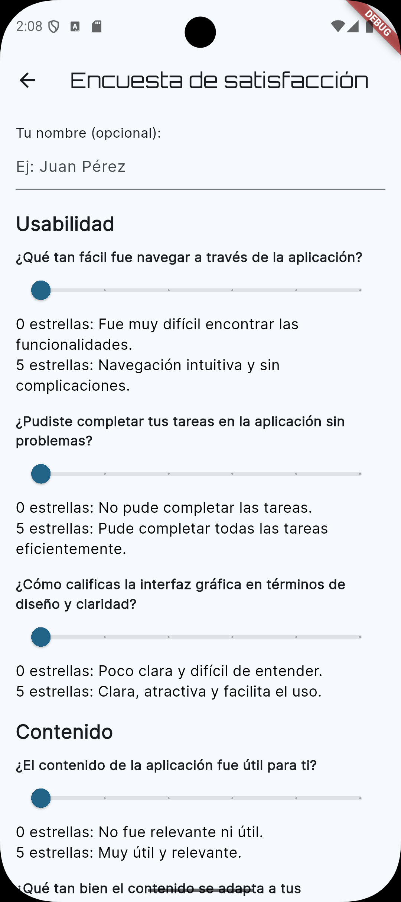

# 11Sync ⚽📱

**11Sync** es una aplicación móvil diseñada para la planificación y administración de equipos de fútbol. Cada usuario puede registrarse con un rol específico (jugador, director técnico, preparador físico, etc.) y acceder a funcionalidades personalizadas que facilitan la organización, el entrenamiento y la comunicación dentro del equipo.

---

## 🚀 Características principales

- Pantalla de inicio personalizada según el rol del usuario
- Registro de datos de rendimiento (velocidad, aceleración, sprint)
- Entrenamientos interactivos con uso del acelerómetro
- Gestión de tácticas: crear, editar, ver y eliminar
- Pantalla de preferencias con configuraciones como:
  - Unidades métricas o imperiales
  - Día de inicio de la semana
  - Permisos para DT
  - Reinicio de estadísticas
- Encuesta de satisfacción integrada y compartible
- Persistencia de datos con `SharedPreferences` y `SQLite`

---

## 🛠️ Tecnologías utilizadas

- [Flutter](https://flutter.dev/) 3.x
- `shared_preferences`
- `sqflite`
- `sensors_plus`
- `share_plus`

---

## 🧪 Encuesta de satisfacción

Los usuarios pueden calificar la aplicación directamente desde la app y compartir sus respuestas fácilmente con el equipo de desarrollo.

---

## 🖼️ Capturas de pantalla

*Agrega aquí tus capturas de pantalla más relevantes (por ejemplo, Home, Entrenamiento, Desempeño, Encuesta, Preferencias, Tácticas)*

```md



```

---

## 📦 Instalación del APK

Puedes compilar el APK ejecutando:

```bash
flutter build apk --release
```

El archivo se encontrará en:

```bash
build/app/outputs/flutter-apk/app-release.apk
```

---

## 📄 Licencia

Este proyecto fue desarrollado como parte de la **Dinámica Práctica 2** del curso *Programación de Dispositivos Móviles (2025/1)*.

---

## ✨ Desarrollado por

**Rodrigo Díaz**

---

¿Tienes sugerencias o deseas colaborar? ¡Abre un issue o pull request!

